# Elemental Base Maps

Static heatmaps showing the spatial distribution of 7 major rock-forming elements across the lunar surface, projected onto a lunar albedo basemap.

---

## Method

Each row in the catalog CSV describes a 12.5 × 12.5 km CLASS observation footprint as a quadrilateral with 4 corner lat/lon pairs. The heatmap pipeline:

1. Computes weight-percentage proxy for each element as `element_area / total_area` (Gaussian peak areas, all elements summed, oxygen excluded from the total).
2. Projects each footprint corner from lat/lon to pixel coordinates using a linear equirectangular mapping.
3. Draws the quadrilateral outline on an OpenCV canvas with a viridis color value derived from the normalized ratio.
4. Alpha-composites the overlay onto the basemap using `cv2.addWeighted`.

Two opacity variants are provided per element — **0.4** (data lighter, basemap geography visible) and **0.7** (data dominant, variation easier to read).

---

## Results

### Iron (Fe)

| 0.4 opacity | 0.7 opacity |
|-------------|-------------|
| 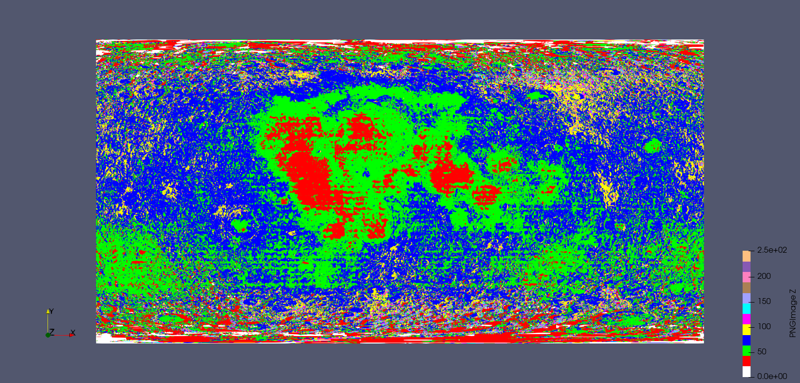 | 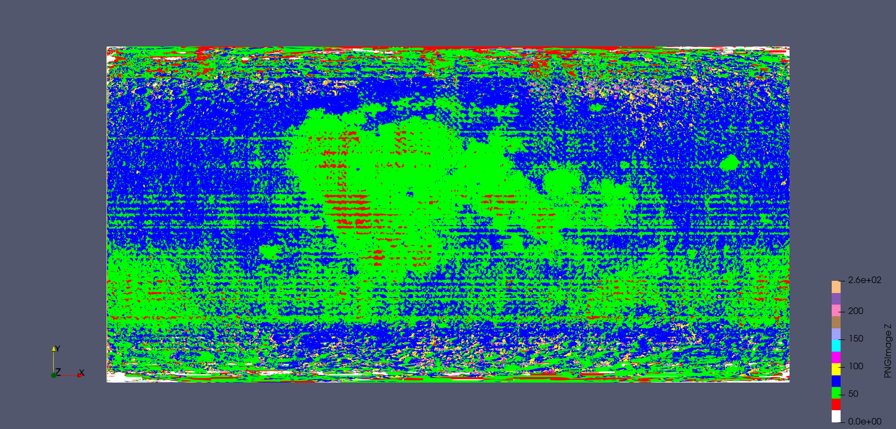 |

Fe concentrates strongly in the maria, particularly Oceanus Procellarum. The highlands show markedly lower Fe, consistent with anorthosite-dominated feldspathic crust.

---

### Magnesium (Mg)

| 0.4 opacity | 0.7 opacity |
|-------------|-------------|
| 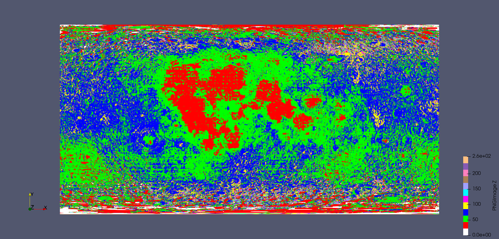 | 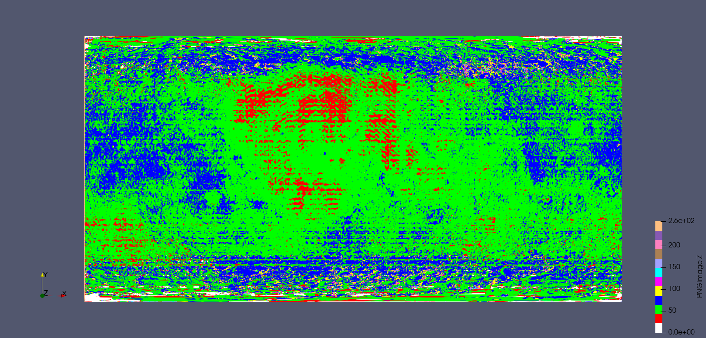 |

Mg tracks Fe spatially — both are elevated in mafic mare basalts (pyroxene and olivine-bearing). The anti-correlation with Al is the clearest geochemical signature of the mafic/feldspathic divide.

---

### Calcium (Ca)

| 0.4 opacity | 0.7 opacity |
|-------------|-------------|
| 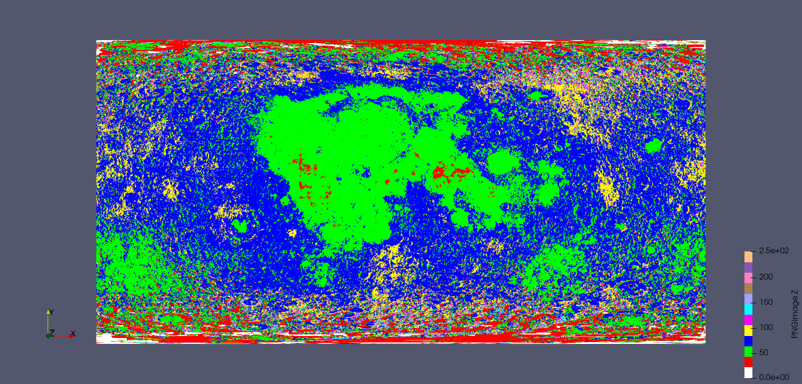 | 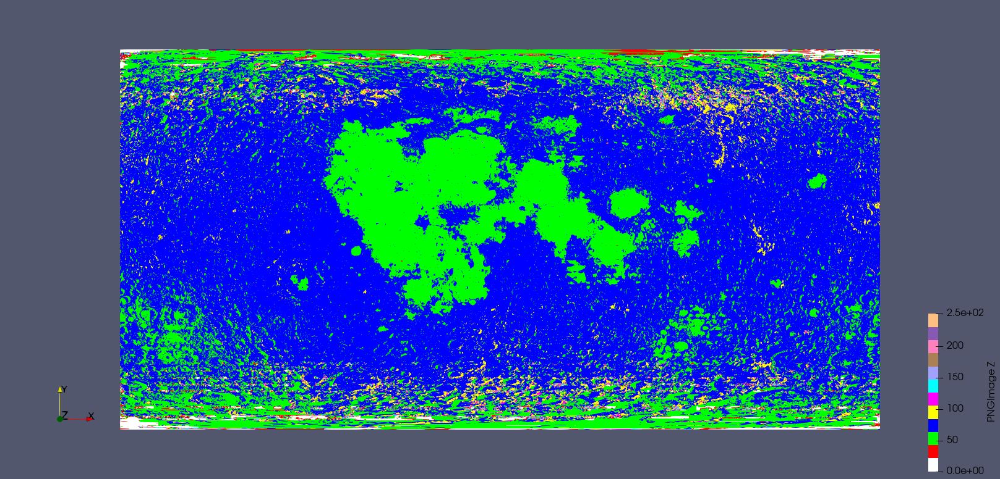 |

Ca shows a more distributed pattern because it appears in both plagioclase (highlands) and pyroxene (mare). It does not cleanly partition between terrains the way Fe and Al do.

---

### Titanium (Ti)

| 0.4 opacity | 0.7 opacity |
|-------------|-------------|
| 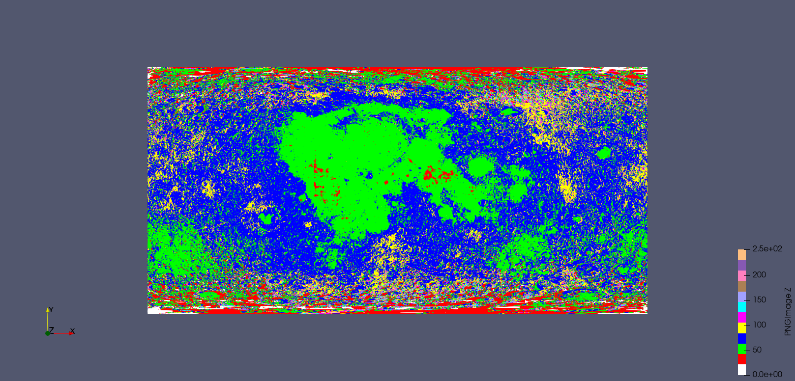 | 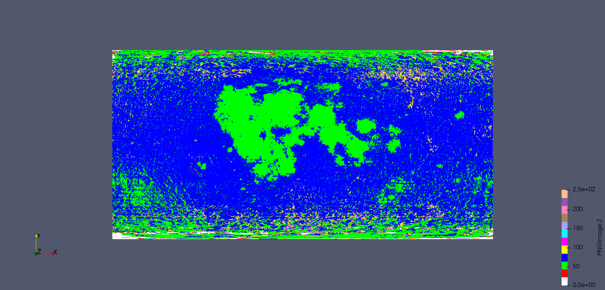 |

Ti is elevated in a subset of mare regions — specifically those with Ti-rich ilmenite basalts, consistent with Lunar Prospector and Apollo sample data.

---

### Silicon (Si)

| 0.4 opacity | 0.7 opacity |
|-------------|-------------|
| 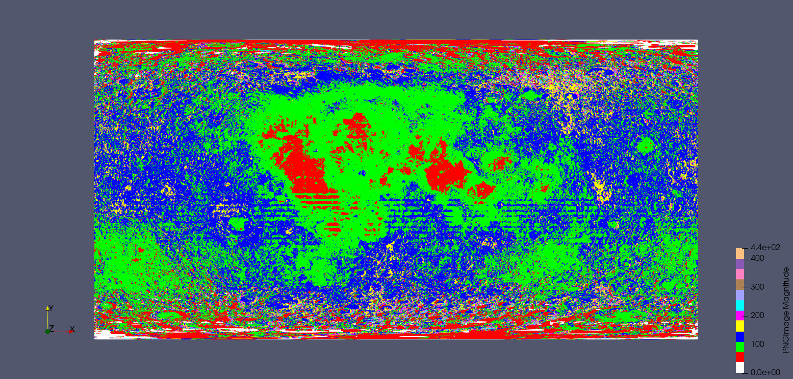 | 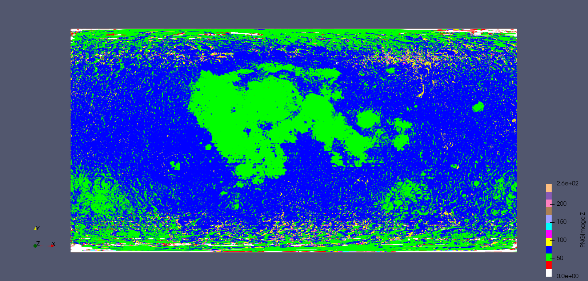 |

Si is broadly uniform, which justifies its use as the normalization reference for element/Si ratios throughout the pipeline.

---

### Aluminum (Al)

| 0.7 opacity |
|-------------|
| 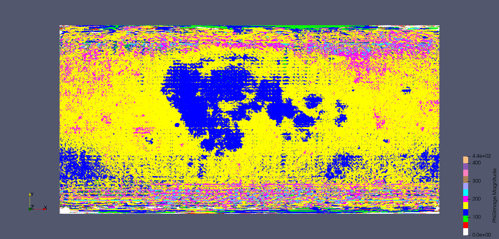 |

Al is highest in the highlands, anti-correlated with Fe and Mg. This is the feldspathic anorthosite signature — Al-rich plagioclase dominates the ancient highland crust.

---

## Libraries

```python
import cv2
from PIL import Image
import numpy as np
import pandas as pd
import rasterio
import matplotlib.pyplot as plt
from matplotlib.colors import Normalize
from matplotlib.cm import ScalarMappable, get_cmap
```

Install rasterio if not present: `pip install rasterio`
