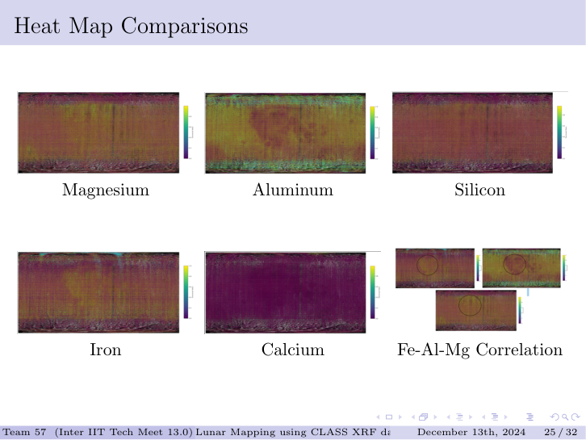
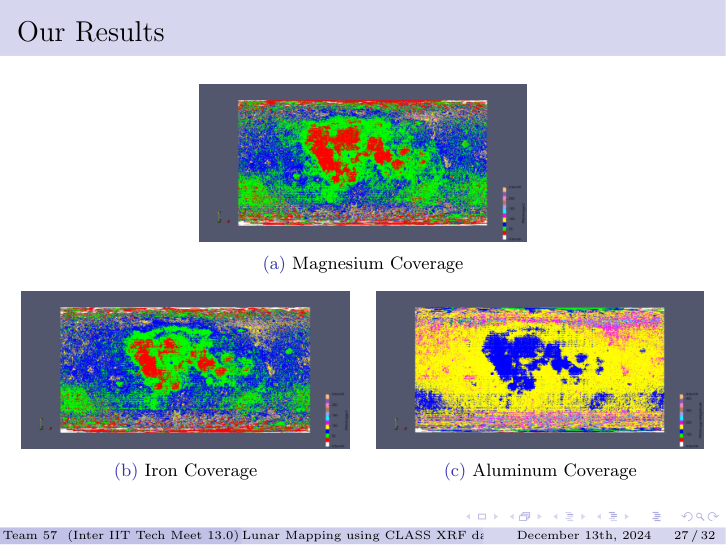
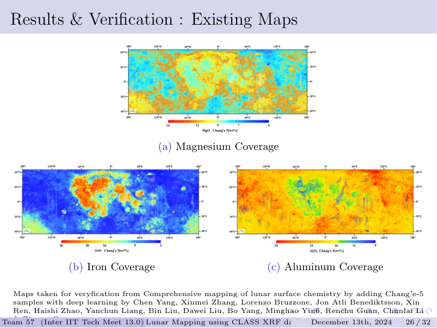

# Elemental Base Maps

Static heatmaps showing the spatial distribution of major rock-forming elements across the lunar surface. Each map overlays color-coded elemental flux ratios onto a lunar albedo basemap, with opacity blending so the underlying geography remains readable.

---

## Method

Each row in the catalog describes a 12.5 × 12.5 km CLASS footprint as a quadrilateral with four corner lat/lon coordinates. The heatmap pipeline:

- Computes an elemental weight-percentage proxy for each element as its Gaussian peak area divided by the sum of all element areas. Silicon is excluded from individual maps but used as the normalization reference elsewhere.
- Projects each footprint's four corners from lat/lon to pixel coordinates using a linear equirectangular mapping onto the basemap image.
- Draws the quadrilateral outline as a color-coded box using the viridis colormap, normalized independently per element so relative spatial variation is maximally visible.
- Alpha-composites the full overlay onto the basemap — two opacity variants are generated per element (0.4 for geography-forward, 0.7 for data-forward).

---

## All Elements at a Glance

The bottom-right panel — the Fe–Al–Mg correlation map — is the most diagnostic result. Fe and Mg co-concentrate in the same mare regions while Al is suppressed there, and Al is elevated exactly where Fe and Mg are low. This three-way anti-correlation is the geochemical fingerprint of the fundamental division between the lunar crust types: mafic basaltic maria versus feldspathic anorthosite highlands.

---

## Detailed Results

**Magnesium** and **Iron** show near-identical spatial patterns, both elevated in Oceanus Procellarum and the major mare basins on the nearside. This is expected — both are concentrated in the ferromagnesian silicates (pyroxene, olivine) that dominate mare basalt mineralogy.

**Aluminum** is anti-correlated with both. It peaks in the far-side highlands, where the ancient anorthosite crust is thickest. Anorthosite is dominated by Ca-Al plagioclase feldspar — Al-rich by definition and depleted in Fe and Mg.

This three-way spatial pattern is not assumed — it emerges from independent Gaussian fits to separate spectral lines. The fact that it reproduces the known mafic/feldspathic divide serves as the primary internal validation of the pipeline.

---

## Verification Against Published Maps

Our Mg, Fe, and Al distributions are compared against published maps derived from Chang'e-5 sample data combined with deep-learning spectral inversion (Chen Yang et al.). The spatial agreement in all three elements — Mg/Fe concentration in Procellarum, Al ring around the highland crust, Fe depletion in highland terrane — confirms that the Gaussian fitting approach and Si-normalization are producing geochemically consistent results from the CLASS spectra alone.

---

## Individual Element Maps

The `final_images/` directory contains per-element PNGs at both opacity levels.

| File | Element | Notes |
|---|---|---|
| `Fe_*.png` | Iron | Elevated in all major mare basins |
| `Mg_*.png` | Magnesium | Co-spatial with Fe — mafic minerals |
| `Al_*.png` | Aluminum | Anti-correlated with Fe/Mg — feldspathic highlands |
| `Ca_*.png` | Calcium | Present in both feldspar and pyroxene — more distributed |
| `Ti_*.png` | Titanium | Elevated in Ti-rich ilmenite basalts; subset of maria |
| `Si_*.png` | Silicon | Broadly uniform — supports its use as normalization reference |
| `Na_*.png` | Sodium | Lower abundance; concentrated in KREEP-rich terrane |

Suffix `_0.4` = 40% overlay opacity. Suffix `_0.7` = 70% overlay opacity.
