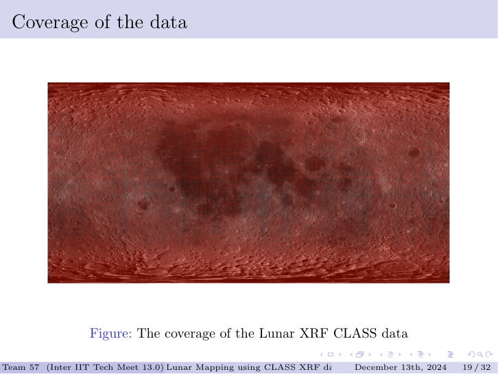
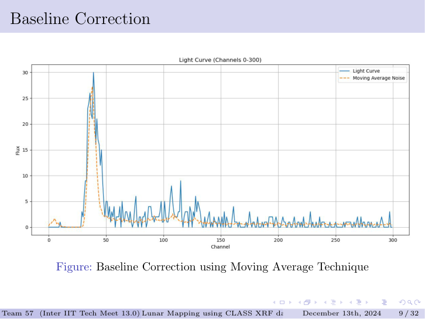
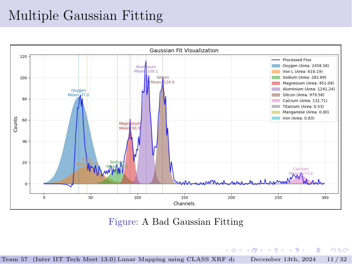
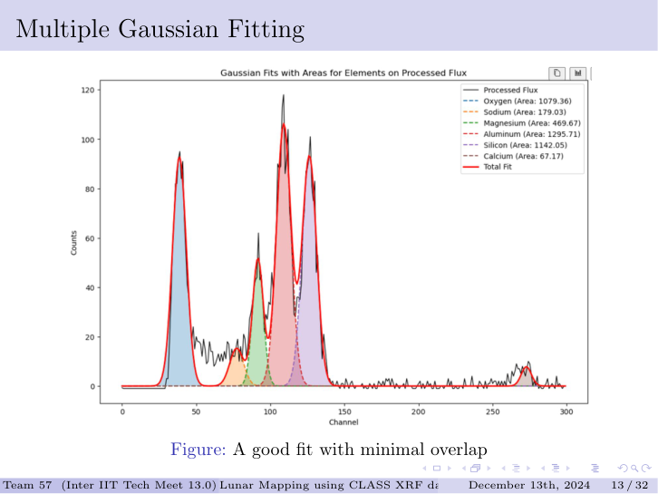
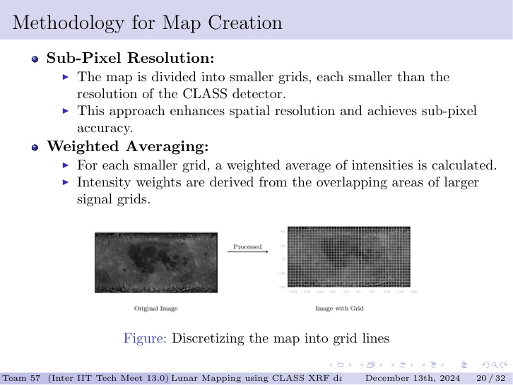
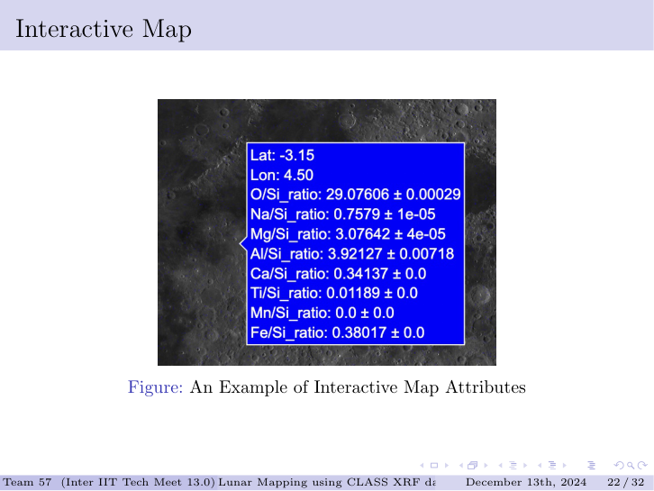

# Lunar Elemental Mapping using Chandrayaan-2 CLASS XRF Data

**Inter IIT Tech Meet 13.0 — ISRO Problem Statement 4 | IIT Bhubaneswar | December 2024**

---

## What This Project Does

The Chandrayaan-2 **CLASS** (Large Area Soft X-ray Spectrometer) instrument records X-ray fluorescence spectra as the satellite orbits the Moon. During solar flares, the enhanced X-ray flux excites surface atoms, which re-emit characteristic secondary X-rays specific to each element. By fitting Gaussians to these emission peaks and computing elemental ratios, you can infer surface composition at orbital scale — non-destructively, across the entire Moon.

This project builds the full pipeline: from raw FITS spectral files pulled from ISRO's Pradan archive, through signal classification, Gaussian fitting, and catalog construction, to two output products — static elemental heatmaps and a GPU-accelerated interactive map where you can hover over any 12.5 × 12.5 km observation cell and read elemental ratios with uncertainties.

---

## Instrument and Data

CLASS uses Swept Charge Devices (SCDs) to detect soft X-rays. Incident photons ionise the semiconductor, generating electron-hole pairs proportional to photon energy. The resulting pulse amplitude is binned into 2048 channels, giving one spectrum per ~0.5 s observation window. Each raw FITS file is a 2048-channel photon count array accompanied by four corner lat/lon coordinates describing the observation footprint on the surface.

The data spans 2021–2024 from ISRO's Pradan archive. XRF lines are only detectable during solar flares — CLASS cross-references XSM (Solar X-ray Monitor) records to gate the usable dataset.

### Instrument Coverage



CLASS has accumulated coverage approaching 95% of the lunar surface on quality-gated flare data, and near-complete coverage when all observations are included.

---

## Pipeline

### Stage 1 — Background Estimation

Individual spectra carry a time-varying noise floor driven by particle background and electronic drift. A static non-flare reference fails because the background shifts across an orbit. The approach taken here is a **moving average background** — quiescent (non-signal) spectra update a running noise estimate with exponential weighting (β = 0.05), so the background adapts continuously across the observation window without overwriting prior statistics.



The orange dashed line is the adaptive background; the blue curve is the raw spectrum. The background tracks the noise floor without being pulled by the signal peaks — which is exactly the separation needed before Gaussian fitting.

---

### Stage 2 — 8-File Co-Addition

Individual spectra have too few photon counts for a reliable multi-Gaussian fit. Eight consecutive FITS files are co-added into a single spectrum before fitting. This is a deliberate SNR trade-off: 8 files span roughly one CLASS native footprint (~12.5 km), so no spatial information is lost, but the co-added photon counts are sufficient for convergence on all element peaks.

---

### Stage 3 — Multiple Gaussian Fitting

This is the most technically involved part of the pipeline. Each co-added spectrum must be decomposed into **10 simultaneous Gaussians** — one per K-alpha line of O, Na, Mg, Al, Si, Ca, Ti, Mn, and Fe (Fe also has a K-beta contribution). The challenge is that these peaks partially overlap, are sitting on a non-flat background, and span a wide range of amplitudes. A naive single-pass fit fails badly.



The bad fit above shows what happens without careful masking: the Oxygen Gaussian blows up to an unrealistic area, Si and Al peaks are miscentred, and the total fit (red line) diverges from the actual spectrum. The fitted areas would produce meaningless elemental ratios.

**The fix — adaptive multi-mask fitting:**

The key insight is that different spectral regions influence the Gaussian fit differently. A wide mask around a peak captures more of the background slope and biases the amplitude downward; a narrow mask focuses only on the peak itself but is sensitive to noise at the edges. Rather than choosing one mask width globally, each element is fitted with multiple candidate mask widths independently, and the result that keeps the fitted mean closest to the theoretical K-alpha channel is selected. This makes the fitting adaptive to local spectral context rather than locked to a fixed configuration that may work for some elements but fail for others.



With adaptive masking, the decomposition is clean: each Gaussian sits at its correct channel, the total fit closely follows the actual spectrum, and the individual peak areas are physically meaningful. The fitted areas — proportional to photon flux — are what become elemental abundance proxies in the catalog.

**Oxygen edge case — analytical continuation:**

The O K-alpha line at channels 37–38 has a specific problem: a large instrumental artifact peak immediately precedes it, and the noise floor is rising sharply in that region. Any fit that includes channels below 37 is dominated by the artifact. The solution is to fit only the right half of the oxygen peak (channels above 37), derive the Gaussian mean from that half, and analytically mirror it to reconstruct the full peak. The result is an oxygen Gaussian that is entirely free from the artifact's influence.

**Spectral overlap correction:**

Even after good fits, adjacent Gaussian tails overlap — most significantly between Si and its immediate neighbours. The area of each Gaussian's tail that falls under the Si peak is computed analytically and factored into the uncertainty of the element/Si ratio:

$$\Delta A = \sqrt{\left(\frac{A_\text{overlap}}{A_1}\right)^2 + \left(\frac{A_\text{overlap}}{A_2}\right)^2}$$

This uncertainty travels through the pipeline and appears as the ± value next to each ratio in the interactive map hover card.

---

### Stage 4 — Catalog

Each processed batch produces one row in the catalog: 8 corner coordinates, 9 elemental Gaussian areas (photon flux proxy), and 8 element/Si uncertainty values. Silicon is the normalization reference — it is uniformly distributed across the lunar surface, which makes element/Si ratios a reliable indicator of relative abundance independent of solar flux variation.

The catalog structure:

| Field | Description |
|---|---|
| V0–V3 lat/lon | Four corners of the 12.5 × 12.5 km footprint |
| `{element}_area` | Area under the Gaussian fit — proportional to photon flux |
| `{element}/Si_uncertainty` | Propagated uncertainty from spectral overlap |

---

### Stage 5 — Map Creation: Sub-Pixel Resolution via Grid Regridding

The 12.5 km native footprint is coarser than what the data density actually supports. Where multiple orbital passes overlap — which happens frequently at mid-latitudes — each observation is an independent spectral measurement of the same cell. Rather than discarding this redundancy, the pipeline regrides to a 0.1° uniform grid (finer than the native footprint) and **averages all observations that fall within each cell**. This is the sub-pixel enhancement: overlapping measurements contribute independently fitted spectra, and their weighted mean represents finer compositional detail than any single pass.



The right panel shows the resulting grid — visually denser and more uniform than the irregular orbital track coverage on the left.

---

### Stage 6 — Interactive Map and Heatmaps

Two output formats are generated from the catalog:

**Interactive Map** — every grid cell becomes a hoverable pin on a lunar albedo basemap. Hover surfaces lat/lon, all 8 element/Si ratios, and their uncertainties. Rendered via WebGL for smooth performance over hundreds of thousands of data points. Covered in detail in [`Interactive Map/`](Interactive%20Map/).

**Elemental Heatmaps** — static PNGs showing normalized flux contribution per element, blended onto the basemap. Covered in [`Lunar Basemaps/`](Lunar%20Basemaps/).

---

## Results

### Interactive Map — Hover Example



Each hover card shows the full elemental composition at that surface location — ratios with propagated uncertainties derived from the spectral overlap correction.

---

### Elemental Distribution — All Elements


The Fe–Al–Mg correlation panel (bottom right) is the single most diagnostic result: Fe and Mg co-concentrate in the maria, while Al is high in the highlands. This is the geochemical signature of the mafic/feldspathic divide — basaltic maria rich in pyroxene and olivine versus feldspathic highlands dominated by anorthosite.

---

### Our Results


Mg and Fe show nearly identical spatial patterns, both elevated in Oceanus Procellarum and the major mare basins. Al is anti-correlated — highest in the far-side highlands where the crust is thickest and most feldspathic.

---

### Verification Against Published Maps


Our Mg, Fe, and Al maps are compared against published maps derived from Chang'e-5 samples combined with deep-learning inversion (Chen Yang et al.). The spatial patterns and relative magnitudes match — the mafic mare distribution, the Al-rich highland ring, the Fe concentration in Procellarum — validating the Gaussian pipeline and the normalization approach.

---

## Repository Structure

```
├── Elemental abundances/    # FITS catalog pipeline notebooks
├── Interactive Map/         # GPU-rendered interactive map + data prep
├── Lunar Basemaps/          # Elemental heatmap notebooks + PNG outputs
├── Report and Journal/      # Full technical report
└── ISRO_PS4_Presentation.pdf
```

---

## Technical Stack

| Layer | Tools |
|---|---|
| FITS I/O | astropy |
| Signal processing | numpy, scipy |
| Spatial indexing | scipy cKDTree |
| Image compositing | OpenCV, Pillow, rasterio |
| Visualization | Plotly (Scattergl / WebGL), matplotlib |

---

**IIT Bhubaneswar | Inter IIT Tech Meet 13.0 | November–December 2024**
